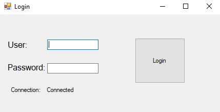
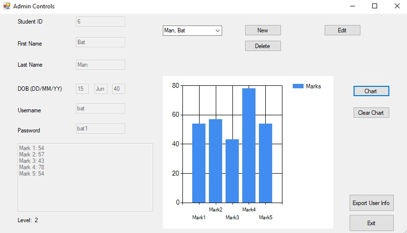
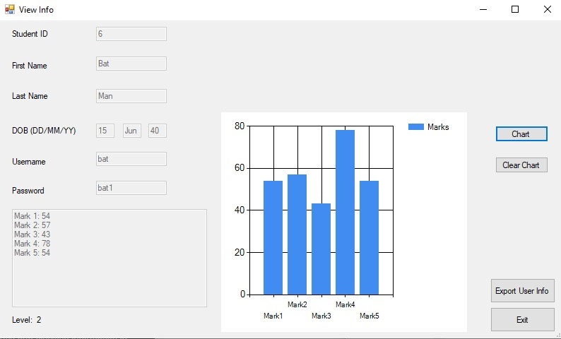

# MarkBook

MarkBook is a comprehensive student management and grade-tracking application developed in C#. Designed with both administrators and students in mind, it offers a robust set of features enabling efficient management of student data and academic performance evaluation through a user-friendly Windows Forms interface.

## Features

### Admin Features
- **User Management:** Add or remove students from the system.
- **Grade Management:** Add, change, and remove grades for students.
- **Analytics:** Visualize student grades through graphs.
- **Calculations:** Automatically calculate the average grades for students.
- **Export Data:** Download student information, including grades, as a PDF.

### Student Features
- **Grade Viewing:** Access and view individual grades.
- **Graphical Analysis:** View a graph representation of grades over time.
- **Average Grades:** Check the calculated average grade.
- **Personal Data Download:** Download personal information and grades as a PDF.

## Screenshots

### Login Page

### Admin Interface

### Student Interface

## Technical Overview

* **Programming Language**: C#
* **Database**: MS Access, with SQL queries for data management.
* **External Resources**: Utilized [connectionstrings.com](https://www.connectionstrings.com) for database connection strings and SQL query execution.

